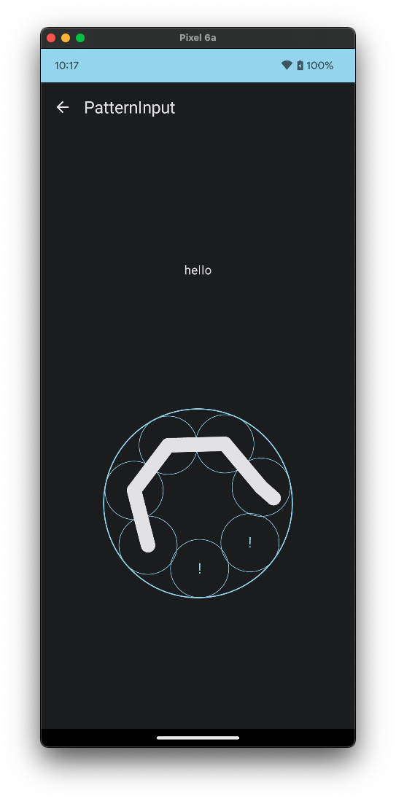
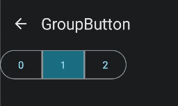
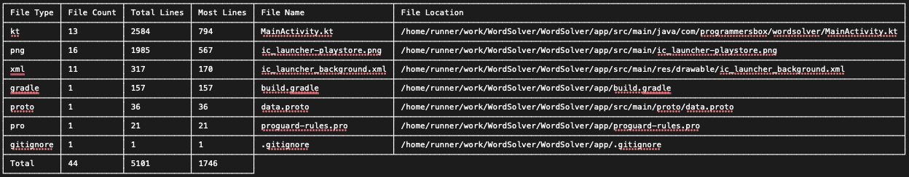

# Jakepurple13Libraries

Compose Utilities I've found myself either reusing or just having fun with

[](https://jitpack.io/#jakepurple13/Jakepurple13Libraries)

# Setup

```kotlin
 maven(url = "https://jitpack.io")
```

```kotlin
implementation("com.github.jakepurple13.Jakepurple13Libraries:patterninput:$purpleLibVersion")
implementation("com.github.jakepurple13.Jakepurple13Libraries:groupbutton:$purpleLibVersion")
implementation("com.github.jakepurple13.Jakepurple13Libraries:diamondloader:$purpleLibVersion")
implementation("com.github.jakepurple13.Jakepurple13Libraries:modifierutils:$purpleLibVersion")
implementation("com.github.jakepurple13.Jakepurple13Libraries:cards:$purpleLibVersion")
implementation("com.github.jakepurple13.Jakepurple13Libraries:navigationcomposeutils:$purpleLibVersion")
```

Or! Use BOM!

```kotlin
implementation(platform("com.github.jakepurple13.Jakepurple13Libraries:libraries-bom:$purpleLibVersion"))
implementation("com.github.jakepurple13.Jakepurple13Libraries:patterninput")
implementation("com.github.jakepurple13.Jakepurple13Libraries:groupbutton")
implementation("com.github.jakepurple13.Jakepurple13Libraries:diamondloader")
implementation("com.github.jakepurple13.Jakepurple13Libraries:modifierutils")
implementation("com.github.jakepurple13.Jakepurple13Libraries:cards")
implementation("com.github.jakepurple13.Jakepurple13Libraries:navigationcomposeutils")
```

# Pattern Input

<details>
    <summary>Documentation</summary>
This is to mimic the Wordscapes input thingy.

<p align="center">
    
</p>

```kotlin
var wordGuess by remember { mutableStateOf("") }
PatternInput(
    options = listOf("h", "e", "l", "l", "o", "!", "!"),
    modifier = Modifier.size(height = 250.dp, width = 250.dp), // a size is required
    optionToString = { it },
    colors = PatternInputDefaults.defaultColors(
        dotsColor = MaterialTheme.colorScheme.primary,
        linesColor = MaterialTheme.colorScheme.onSurface,
        letterColor = MaterialTheme.colorScheme.primary,
    ),
    sensitivity = 100f,
    dotsSize = 50.sp.value,
    linesStroke = 50f,
    circleStroke = Stroke(width = 4.dp.value),
    animationDuration = 200,
    animationDelay = 100,
    onStart = {
        wordGuess = ""
        wordGuess = it.id
    },
    onDotRemoved = { wordGuess = wordGuess.removeSuffix(it.id) },
    onDotConnected = { wordGuess = "$wordGuess${it.id}" },
    onResult = { /*Does a final thing*/ }
)
```

</details>

# NavigationUtils

<details>
    <summary>Documentation</summary>

This was something I found myself copying and pasting to many different projects.

So instead of needing to pass a `navController` around, this allows us to do:

```kotlin
val navController = LocalNavController.current
```

To set it up, you must have:

```kotlin
ProvideNavController { /*composable content here*/ }
```

If you don't want the default (which is just `rememberNavController()`) since maybe you need to add
a navigator, you can pass that in!

```kotlin
ProvideNavController(rememberNavController()) { /*composable content here*/ }
```

</details>

# GroupButton

<details>
    <summary>Documentation</summary>

This is a segmented button

<p align="center">
    
</p>

```kotlin
var item by remember { mutableStateOf(1) }

GroupButton(
    selected = item,
    options = (0..2).map {
        GroupButtonModel(
            item = it,
            iconContent = { Text(it.toString()) }
        )
    },
    onClick = { item = it }
)
```

Group button is generic so things can be typed!
</details>

# ProjectInfo Plugin

<details>
    <summary>Documentation</summary>

This is to view some information about the project like number of files of a type, line count, total
lines, and showing the file with the most number of lines!

<p align="center">
    
</p>

<details>
    <summary>Gradle</summary>

```gradle
plugin {
    id 'io.github.jakepurple13.ProjectInfo' version [version] apply false 
}
```

</details>

<details>
    <summary>KTS</summary>

```kotlin
plugin {
    id("io.github.jakepurple13.ProjectInfo") version [version] apply false
}
```

</details>

<details>
    <summary>Classpath</summary>

```kotlin
classpath("io.github.jakepurple13.ProjectInfo:projectinfoplugin:1.0.9")
```

</details>

Some modifiable things:

```kotlin
projectInfo {
    //Set a custom sortWith using Comparator!
    sortWith = compareByDescending { it.second.maxOf { it.size } }
    //add file types you want to exclude
    excludeFileTypes
    //to filter further:
    filter {
        //Then use normal excludes/includes here!
    }
    //To include some File Line Count Validation:
    fileLineCountValidation {
        //You can choose a custom color!
        //The color makes use of https://github.com/ajalt/mordant
        customColor(0f, 0.5f, 1f)
        color = TextColors.red
        //Add file types to check. So kt, kts, java, etc
        fileTypesToCheck.add("kt", "kts")
        //And finally, add a line count to flag the colors on.
        //This sample will flag kt and kts files that are above 100 lines of code
        lineCountToFlag = 100
        //In instances where you don't want this validation to run, you can set this variable to false
        runValidation = true
    }
}
```

</details>